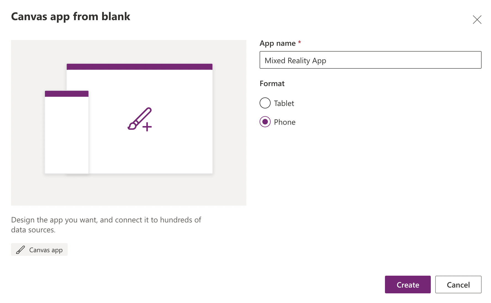
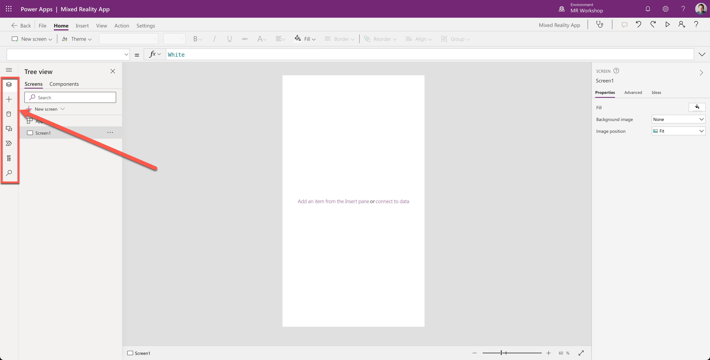

# Lab 01 - Use the Creator Kit for Canvas Apps development

In this lab, we are going to use the Creator Kit to speed up the development of Canvas Apps. The Creator Kit is a set of components based on Fluent UI which you can use in Canvas Apps. Check out the links in the following note to learn more about the Creator Kit.

> **NOTE:**
>
> For more information about the Creator Kit, make sure to check out the following links:
>
> - [Overview of the Creator Kit components](https://docs.microsoft.com/power-platform/guidance/creator-kit/components)
> - [Use the Creator Kit](https://docs.microsoft.com/power-platform/guidance/creator-kit/creator-kit-explained)
> - [Theming](https://docs.microsoft.com/power-platform/guidance/creator-kit/theme)
> - [Creator Kit Release Notes](https://aka.ms/creatorkitlatestrelease)

## Installing the Creator Kit

The Creator Kit is not available out of the box, so we need to import the Creator Kit solution first. But, before the import can happen, we need to enable a setting so that we can use the Creator Kit code components in Canvas Apps.

### Enable code components in Canvas Apps

To enable code components in Canvas Apps, you need to go to the [Power Platform Admin Center](https://aka.ms/ppac). In the Power Platform Admin Center, select **Environments** in the left navigation. Click on the **...** next to the environment you're going to use (it probably has the name **{Your name}'s environment**) and select **Settings**.

Select the **˅** next to ⚙ Product and select **Features**. Turn on the setting **Allow publishing of canvas apps with code components**.

### Import the solution

With this setting enabled, we can now import the Creator Kit solution. Download the solution via [this link](https://aka.ms/creatorkitdownload) and go to [make.powerapps.com](https://make.powerapps.com). Make sure you are in the correct environment (the one where we just enabled the code components feature) and select **Solutions** in the left navigation.

At the top of the solution screen, select the **← Import Solution** button, click on the **Browse** button and select the Creator Kit solution we just downloaded. When the solution is selected, you can click on the **Next** button on the bottom of the screen and after that, select **Import**. Now the solution will be imported. Usually that will take a minute or two. When the importing is finished, you will see a green bar with a import successful message.

## Creating the Canvas App

When you're ready to create a Power Apps Canvas App, like you're going to do today, you always want to start by going to the maker portal. In this case, we're going to the Power Apps maker portal.

👩🏾‍💻 [Power Apps Maker Portal](https://make.powerapps.com)

> **Note:**
>
> It's very important to create a solution and not start from Create or Apps. Solutions give you a lot more possibilities. For instance, you can more easily perform application lifecycle management (ALM) on it.

## Create a solution

Navigate to solutions in the left hand menu. In the solution view, click the '**+ New Solution**' button at the top. A side bar will open where you can add your solutions' display name, name (internal name), a publisher and a version. When creating a new publisher, only fill in the required fields.

> **Note:**
>
> Be aware that the new publisher will have a prefix value. That prefix value will be added to the internal name of every component you create in this solution. When you use 'msft' as a prefix, you will get 'msft\_' as a prefix before every component that gets created in the solution.

For this solution, we will use the following values:

- **Display Name**: `Mixed Reality Workshop`
- **Name**: `MixedRealityWorkshop`
- **Publisher**: `create a new one to your own liking and select that one when you are done creating it`
- **Version**: `1.0.0.0`

There is also a 'more options' option available, but we will not use that in this workshop.

When you have filled in all the values above, click on the **Create** button and your solution will be created. The solution you have created should appear in the solution list after you clicked on the create button.

Click on the display name of your solution to open the solution. This should lead you to the following screen:

Select **+ New** > **App** > **Canvas App**. The 'Canvas App from blank' dialog will show up. Use `Mixed Reality App` as the app name, change the format to `Phone`, and click on the `Create` button.

The Power Apps Studio will open up. When you're here for the first time, a welcome dialog will show. Select the `Skip` button.

### Import the Creator Kit components

On the left you will see the left navigation. The first thing we want to do is add the components from the Creator Kit. Select the **+** in the left navigation. This will open the `Insert` menu. The insert menu will contain all the components you can add to your app. We have imported the Creator Kit in our environment, so those components will need to be added to the app. At the bottom of the insert menu will see the `Get more components` button. Make sure to select the **Get more components** button. This will open a sidebar on the right to import components.

The import components sidebar has two tabs at the top: `Canvas` and `Code`. The Canvas components are created with Canvas Apps, while the Code components have been build with the Power Apps Component Framework (PCF).

> **Note:**
>
> Remember, you can take a look at which components are part of the Creator Kit via the [Overview of the Creator Kit components page](https://docs.microsoft.com/en-us/power-platform/guidance/creator-kit/components).

Select the `Select all` button and select the `Import` button. This will add all the `canvas components` to your **insert** menu. When imported, you can find them in the `Library components` group.

If all components are imported correctly, you will see the following message at the the top of your screen.

Now select the **Get more components** button again, and select the `Code` tab to add the components one by one to the app. This will add the `code components` to your **insert** menu. When imported, you can find them in the `Code components` group.

After finishing importing all the components, make sure to select **File** and the **Save** button on the bottom right to **save** your app.
