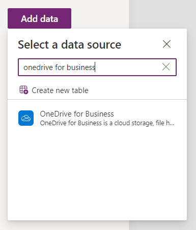
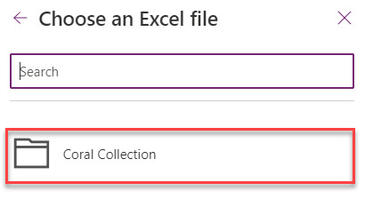
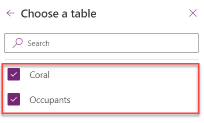
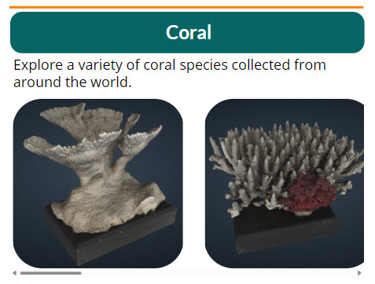
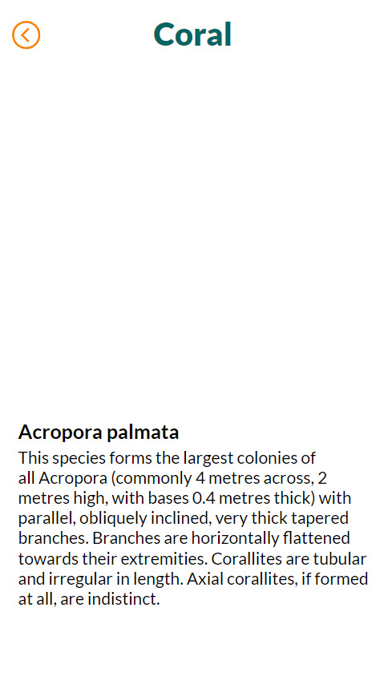
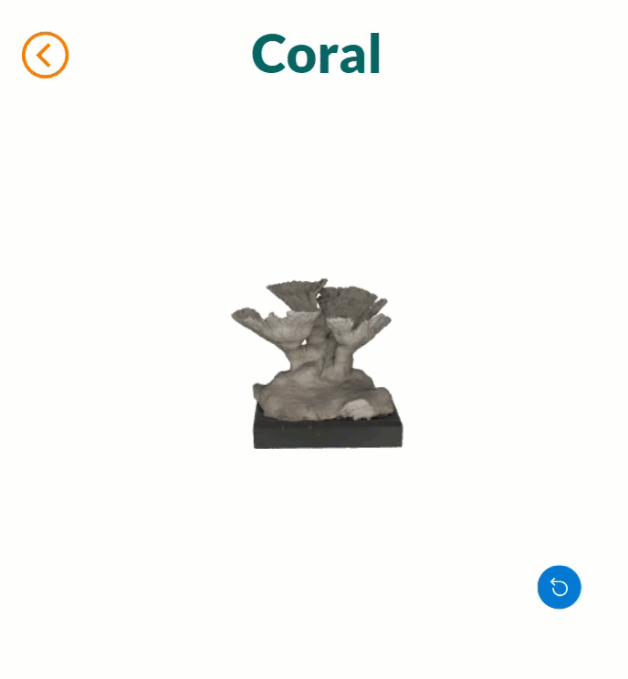
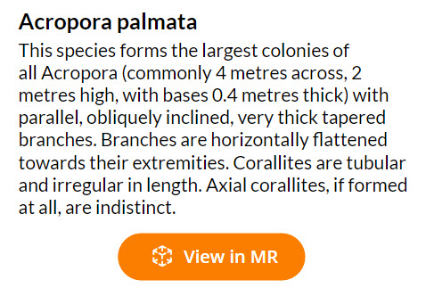
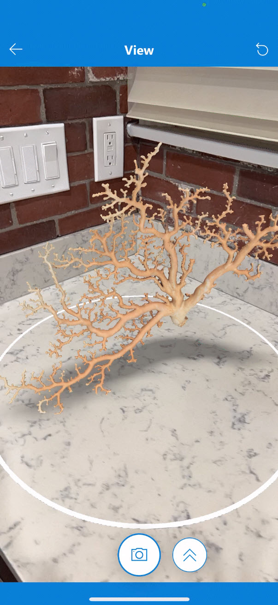
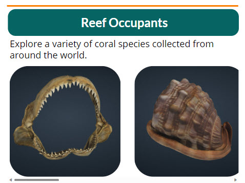

# Lab 02 - Use View in MR in Canvas Apps

## Upload Assets to OneDrive

For this app, we'll leverage OneDrive as our repository for the coral collection objects and their respective information. This enables us to utilize **OneDrive for Business** as a data connector.

We've provided the following assets that'll need to be uploaded to OneDrive:

| Type              | Asset                | Description                                                                  |
| ----------------- | -------------------- | ---------------------------------------------------------------------------- |
| Folder            | Models               | Contains model files for coral and reef occupants                            |
| Folder            | Photos               | Contains photos of the coral and reef objects                                |
| Excel Spreadsheet | CoralCollection.xlsx | Object information (species, description, relative links to model and photo) |

> **Note:**
>
> Within the Excel spreadsheet are **Coral** and **Occupants** tables which includes a specified range of rows and columns. In addition, the spreadsheet uses relative links which references files within the **Models** and **Photos** folders. If you later plan to add your own models, be sure to follow the format provided in the spreadsheet and modify the range for the respective table.

Let's create a new **Coral Collection** folder in OneDrive and upload these assets.

1. In the browser, navigate to [portal.office.com/onedrive](https://portal.office.com/onedrive).
1. Sign-in using your **administrator credentials** for the M365 Developer Program.
1. In OneDrive, click **+New** to create a new folder. Name the folder **Coral Collection**.

   

1. Inside the **Coral** folder, drag or upload the **Models**, **Photos**, and **CoralCollection.xlsx** assets .

   

## Connect Data

Now that we have our Coral Collection objects stored in OneDrive, we can use **OneDrive for Business** as a data connector to access the collection's assets within the **Coral Collection** folder. Let's connect to **OneDrive for Business** and select the the **Coral** and **Occupants** tables within the **CoralCollection.xlsx** spreadsheet. This connection will enable us to seamlessly reference the object images, photos, and information within the spreadsheet.

1. Go to [make.powerapps.com](https://make.powerapps.com) and select **Solutions** in the left navigation.
2. Select our **Mixed Reality Workshop** solution.
3. Click on the display name of the `Mixed Reality App` to open up the Power App in edit mode.
4. In Power Apps, in the left panel, click the **Data** icon and click **Add Data**.
5. In the **Select a data source** window, search for **OneDrive for Business** and select the result.

   

6. After you select **OneDrive for Business**, the result will display your email address. Select **OneDrive for Business** once more.
7. In the **Choose an Excel file** tab that appears, select the **Coral Collection** folder.

   

8. Inside the **Coral Collection** folder, select the **CoralCollection.xlsx** file.

   

9. Select both the **Coral** and **Occupants** table.

   

10. At the bottom of the panel, click **Connect**.

After the data is connected, Power Apps will add a new **PowerAppsID** column to the spreadsheet. This column contains the Power Apps generated unique ID for the object.

## Rename 'Screen1' Screen

With a connection made to the Coral Collection objects, we're now ready to create the galleries! For the app, we'll have a gallery for **Coral** and another for **Reef Occupants**. Each gallery will provide a list of all objects available for view. You'll be able to select an object to learn more and also view the object in both 3D and Mixed Reality.

Rename the **Screen1** screen to **Galleries Screen** by clicking on the **...** next to **Screen1** and then select **Rename**.

### Add the Galleries Screen UI

Let's first start with designing some of the basic UI for the Galleries Screen.

1. In the **Insert** tab, click **Text label** to add a heading for the screen. Rename the component **lblCollectionTitle**. In the right panel, change the following properties:

   - **Text**: Corals and Coral Reefs
   - **Font**: Lato Black
   - **Font Size**: 44
   - **Font Weight**: Bold
   - **Position**: 21 x 18
   - **Size**: 600 x 123
   - **Color**: Black or ColorValue("#000000")

1. In the **Insert** tab, click **Text label** to add a subheading for the screen. Rename the component **lblSubheading**. In the right panel, change the following properties:
   - **Text**: Discover the collection
   - **Font**: Open Sans
   - **Font Size**: 16
   - **Font Weight**: Semibold
   - **Position**: 21 x 141
   - **Size**: 560 x 41
   - **Color**: Black or ColorValue("#000000")

We'll now create the section for the **Coral** gallery. Once you've created the **Coral** section, you can duplicate the components to create the **Reef Occupants** section.

1. We'll create a divider to separate the sections. In the **Insert** tab, search for **Rectangle**. Rename the component **divSection1**. In the right panel, change the following properties:

   - **Position**: 18 x 190
   - **Size**: 601 x 4
   - **Color**: ColorValue("#FA7E01")
   - **Border Thickness**: 0

1. To add a bit of style to the section headings, we'll leverage the **Button** component which enables us to modify the **Border radius**. However, we'll leave the button inactive so that the component cannot be pressed. In the **Insert** tab, **Input > Button**. Rename the component **btnCoralHeading**. In the right panel, change the following properties:

   - **Text**: Coral
   - **Position**: 20 x 200
   - **Size**: 601 x 70
   - **Padding Left**: 10
   - **Color-Fill**: ColorValue("#066563")
   - **Border Thickness**: 0
   - **Border Radius**: 20
   - **Font**: Lato
   - **Font Size**: 24
   - **Font Weight**: Semibold

1. In the **Insert** tab, click **Text label** to add a description for the section. Rename the component **lblSubCoral**. In the right panel, change the following properties:
   - **Text**: Explore a variety of coral species collected from around the world.
   - **Font**: Open Sans
   - **Font Size**: 18
   - **Font Weight**: Normal
   - **Position**: 20 x 270
   - **Size**: 601 x 70

### Create the Gallery

We'll now add in the gallery for the **Coral** section. Once complete, we'll have a horizontal collection of objects that you can scroll through and view images of the available objects for viewing.

1. In the left panel, click the **Insert** icon and search for **Blank horizontal gallery**.
1. On the **Select a data source** window that appears, select the **Coral** data source.
1. Rename the **Gallery** component **galCoralGallery**.

> **Note:**
>
> The **CoralCollection.xlsx** file must be closed before you complete the next step. If the file is open (whether desktop or in the browser), the data for the gallery will not populate.

What's great about the gallery component is that the configurations set for one column applies to all columns! We'll configure the first column so that all columns are properly set for each object in the gallery.

1. Select the **galCoralGallery** component. In the right panel, change the following properties:

   - **Position**: 19 x 295
   - **Size**: 601 x 357

1. On the **galCoralGallery** component, click **Add an item from the Insert pane**.

1. In the **Insert** pane, select **Media > Image\*\*** to add an **Image** component to the gallery.

1. Rename the **Image** component to **imgCoral**.

1. We'll now modify the properties for the image component. Select the **Image** component and in the right panel change the following properties:
   - **Image**: `ThisItem.Picture`
   - **Position**: 0 x 48
   - **Size**: 290 x 288
   - **Border radius**: 50

Let's now add navigation to the **Coral Information** screen. Essentially, when you select one of the images, the app will navigate to the **Coral Information** screen.

1. In the first column of the **galCoralGallery**, select the **imgCoral** component.

1. In the formula bar, for **OnSelect** enter `Navigate('Coral Information',ScreenTransition.Fade)`.

Since we haven't created the **Coral Information** screen, you'll be given an error - we'll fix that in the next step!

## Create Coral Information Screen

Once an object is selected from the Gallery screen, the app should navigate to **Coral Information** screen which displays the following information about the coral:

- Species
- Description
- 3D Model
- Button to View in MR

We'll setup the screen for the **Coral** objects and later duplicate and reconfigure for the **Reef Occupants**. Let's first create the basic UI for the screen.

1. In the top navigation menu, click **New Screen > Blank**.

1. In the left panel, rename the new screen **Coral Information**.

1. In the left panel, search for the **Back arrow** icon. Rename the component **icoBackArrow**. In the right panel, change the following properties:

   - **Position**: 20 x 36
   - **Size**: 47 x 47
   - **Font Color**: ColorValue("#FA7E01")
   - **Border Thickness**: 0

1. In the formula bar, for the **icoBackArrow**, change the **OnSelect** to `Navigate(Galleries,Fade)`.

1. In the **Insert** tab, click **Text label** to add a label that'll display the title. Rename the component **lblCoralTitle**. In the right panel, change the following properties:

   - **Text**: Coral
   - **Font**: Lato Black
   - **Font Size**: 40
   - **Font Weight**: Semibold
   - **Text Alignment**: Align Center
   - **Position**: 105 x 24
   - **Size**: 443 x 70
   - **Font Color**: ColorValue("#066563")

1. In the **Insert** tab, click **Text label** to add a label for the species. Rename the component **lblCoralSpecies**. In the right panel, change the following properties:

   - **Text**: `galCoralGallery.Selected.Species`
   - **Font**: Lato
   - **Font Size**: 25
   - **Font Weight**: Semibold
   - **Position**: 25 x 694
   - **Size**: 588 x 51

1. In the **Insert** tab, click **Text label** to add a label for the description. Rename the **Text label** component **lblCoralDesc**. In the right panel, change the following properties:
   - **Text**: `galCoralGallery.Selected.Description`
   - **Font**: Lato
   - **Font Size**: 21
   - **Font Weight**: Normal
   - **Position**: 25 x 732
   - **Size**: 604 x 294

Test the app to confirm that when an object is selected from the **Galleries Screen** screen, the **Coral Information** screen displays it's respective information.

## Add the View in 3DControl

We'll now add the **View in 3D** control which will enable you to view 3D content in the app. You can rotate and zoom into the model with simple gestures.

Let's add the control and configure for viewing the object in 3D.

1. In the left panel, click the **Insert** icon and select **Media** > **3D Object**.

1. In the formula bar, for **Source** enter `galCoralGallery.Selected.'3DModel'`.

1. In the left panel, rename the **View in 3D** component **3dCoral**.

1. In the right panel, change the following properties:
   - **Background fill**: Transparent
   - **Position**: 40 x 95
   - **Size**: 561 x 536

Test the app to view the 3D model of the object.

## Add the View in MR Control

We'll now add the **View in MR** control which will enable you to view the object in your physical environment. The View in MR control creates a button in your app which overlays the respective 3D model onto the live camera feed of your device.

Let's add the control and configure for viewing the object in MR.

1. In the left panel, click the **Insert** icon and select **Mixed Reality** > **View in MR**.

1. In the formula bar, for **Source** enter `galCoral.Selected.'3DModel'`.

1. In the left panel, rename the **View in MR** component **mrCoral**.

1. In the right panel, change the following properties:
   - **Position**: 179 x 1037
   - **Size**: 280 x 70
   - **Border radius**: 50
   - **Color-Fill**: ColorValue("#FA7E01")
   - **Border Thickness**: 0

Test the app to view the 3D model in Mixed Reality.

## Apply What You've Learned

Congratulations - you've setup the configurations for the **Coral** gallery and should now have a functioning app! Now it's time to apply what you've learned and configure the same functionality for the **Reef Occupants** gallery.

### Galleries Screen

You can duplicate the existing components created for the **Coral** gallery. Be sure to change the **Text** properties where appropriate. For example, the **description** for the **Reef Occupants** section should read: _Learn more about the animals who inhabit coral and coral reefs._

To help keep things organize, change the component names where appropriate. For example, consider renaming the gallery to **galReefOccupants**.

Since the gallery is currently using the **Coral** data source, you'll need to switch to the **Occupants** data source instead to view the models within the **Occupants** table. Also, be sure to change the **OnSelect** property so that selecting an image navigates to the **Reef Occupant Information** screen.

### Reef Occupant Information Screen

Likewise, you can duplicate the **Coral Information** screen to create the **Reef Occupant Information** screen. We recommend modifying the component names to reflect the **Reef Occupant** to help keep things organized.

Be sure to change the **Text** properties where appropriate. For example, the **title** for the screen should display: _Reef Occupants_.

The remaining components in the screen are all currently pulling data from the **galCoral**. Therefore, be sure to modify the formulas where appropriate so that the data is populated from the **galReefOccupants**.

### Create the home screen

In the next labs, you will create another experience in this app, so it makes sense to have a new home screen.

1. In the top navigation menu, click **New Screen > Blank**.
1. In the left panel, rename the new screen **Overview Screen**.
1. Scroll up and select **App** in the tree view.
1. Enter **'Overview Screen'** as the value for **StartScreen**. This will make sure your app opens the **Overview Screen** when you open the app.
1. If you want, you can select the **...** next to the **Overview Screen** and move the screen to the top of the list.

Save the app, to make sure you won't lose any work.

1. In the **Insert** tab, click **Text label** to add a heading for the screen. Rename the component **lblOverviewTitle**. In the right panel, change the following properties:

   - **Text**: Mixed Reality Workshop
   - **Font**: Lato Black
   - **Font Size**: 44
   - **Font Weight**: Bold
   - **Position**: 21 x 18
   - **Size**: 600 x 160
   - **Color**: Black or ColorValue("#000000")

1. We'll create a divider to separate the sections. In the **Insert** tab, search for **Rectangle**. Rename the component **divOverview**. In the right panel, change the following properties:

   - **Position**: 18 x 190
   - **Size**: 601 x 4
   - **Color**: ColorValue("#FA7E01")
   - **Border Thickness**: 0

1. In the **Insert** tab, **Input > Button**. Rename the component **btnOverviewCoral**. In the right panel, change the following properties:

   - **Text**: Corals and Coral Reefs
   - **Position**: 20 x 200
   - **Size**: 601 x 70
   - **Padding Left**: 10
   - **Color-Fill**: ColorValue("#066563")
   - **Border Thickness**: 0
   - **Border Radius**: 20
   - **Font**: Lato
   - **Font Size**: 24
   - **Font Weight**: Semibold
   - **OnSelect** (under the Advanced tab): Navigate('Galleries Screen', Fade)
   - **HoverFill**: ColorValue("#FA7E01")

### Modify the Galleries Screen

Select the **Galleries Screen** in the tree view. To make the **Overview Screen** accessible from the **Galleries Screen**, let's add a home icon.

Select the **Insert** icon in the left navigation and search for **'home'**. This will show you the home icon. Click on home icon and it will get added to your screen. Rename the icon to **icoGalleriesHome**.

In the right panel, change the following properties:

- **Position**: 555 x 47
- **Color**: Black or ColorValue("#000000")
- **OnSelect** (under the Advanced tab): Navigate('Overview Screen', Fade)

This concludes lab 03.
